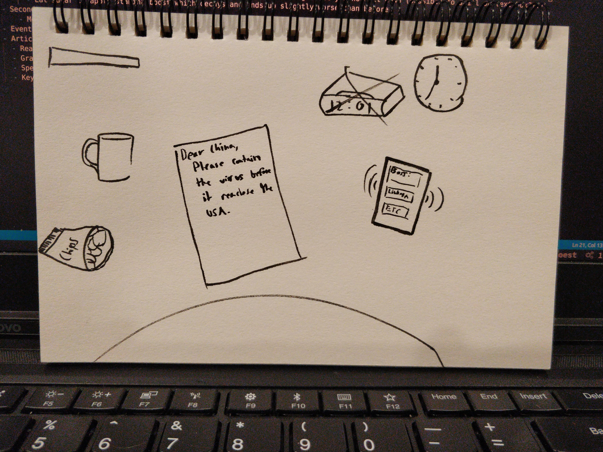

# destination-wuhan

# UI

## _All hail Wuhan!!! Please note we're not from Wuhan, or China, that's important to note._

As a brave reporter you must write an in depth article about the Corona Virus. If the article lass in quality your company is threatening to smuggle you into Wuhan, China in order to give you a personal experience with COVID-19.

Wuhan Wuhan Wuhan Wuhan

# Intro
Boss: We need you, our ace reporter, to report on the corona virus epedemic! You're scheduled for a flight in the morning to serve as our boots on the ground.
You: If I can finish the paper before my flight I can avoid going! 

- Features:
    - Core:
        - Stats:
            - Stamina Bar - always decreasing (required to move on to the next web page, if you're stamina is too low how will you click on the next link after all?)
              - Low stamina -> tired -> screen blurs (is this still a web browser based game? are we moving to unity? I like it!)
            - Heart beat - coffee and sugar temporarily make heart beat louder. eventually you get a palpatation and it gets weird (heart beats can also be a sign of weakness, don't make yourself weak!)
            - Click with mouse coffee to increase stamina (but if stamina too low good luck!)
        - Controls:
          - Type article into a text box (will be cross referenced with grammarly to make sure the user is using proper English grammar)
          - Drag the coffee down the screen a bit to drink and keep drinking until you hold it down (possible to spill on text box???)
          - Eat sugar to apply stamina boost which decays and ends up slightly worse than before
    - Secondar:
        - Mechanical keyboard noises
    - Events
    - Article Grading:
      - Reader grade level analysis
      - Grammar check (Grammarly good!) (shake screen and berate player when bad spelling!)
      - Spell check
      - Keyword checking when boss goes by

## Sound Credits

"Heartbeat, Regular, Single, 01-01, LOOP.wav" by InspectorJ (www.jshaw.co.uk) of Freesound.org

## Image Credits

https://www.publicdomainpictures.net/en/view-image.php?image=317486&picture=coronavirus-advice
https://www.publicdomainpictures.net/en/view-image.php?image=20113&picture=couple-with-blank-frame
https://www.publicdomainpictures.net/en/view-image.php?image=42647&picture=old-wood-frame
https://www.toptal.com/designers/subtlepatterns/wood-pattern/

## Music Credits

https://freemusicarchive.org/music/Mild_Wild/a_Queens_Lodge_b_Crooked_Straight/Crooked_Straight